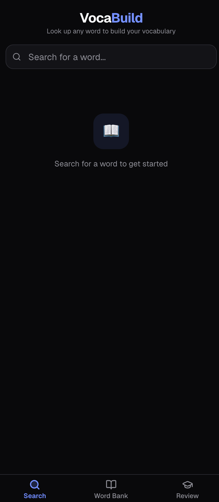
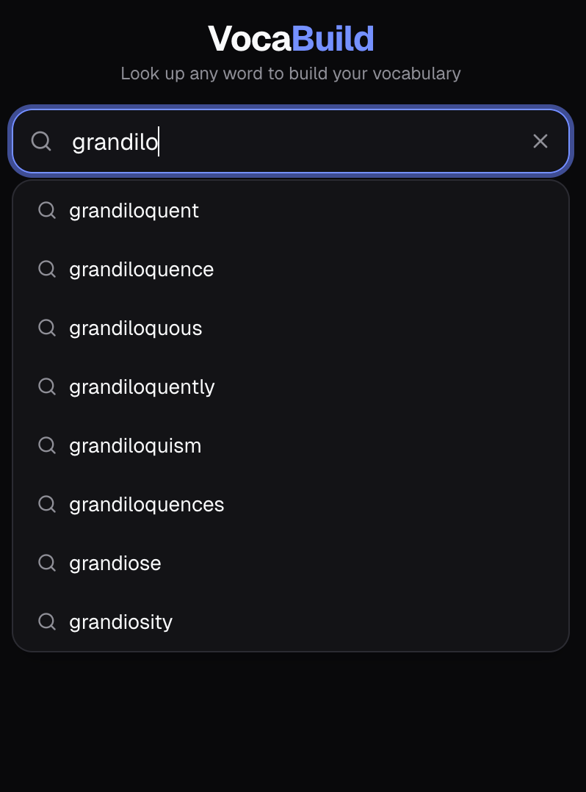
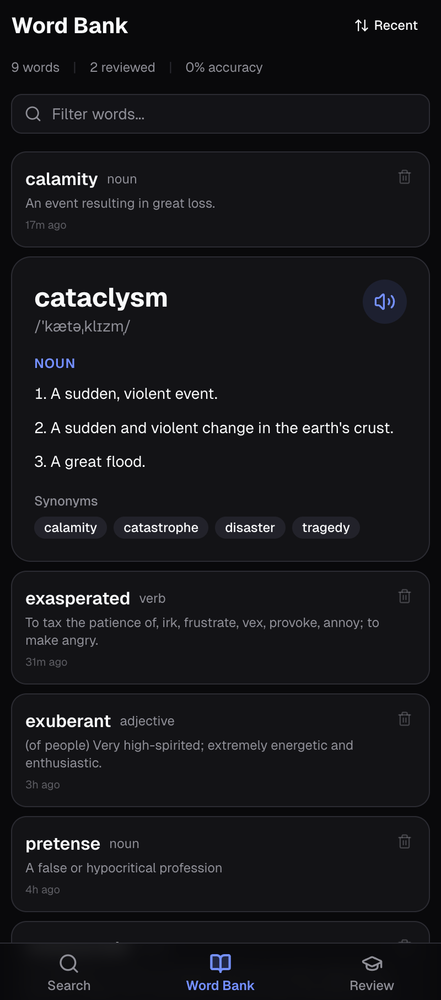
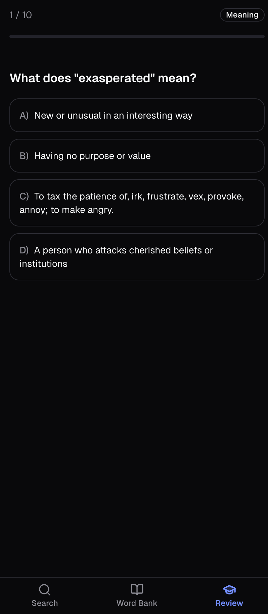
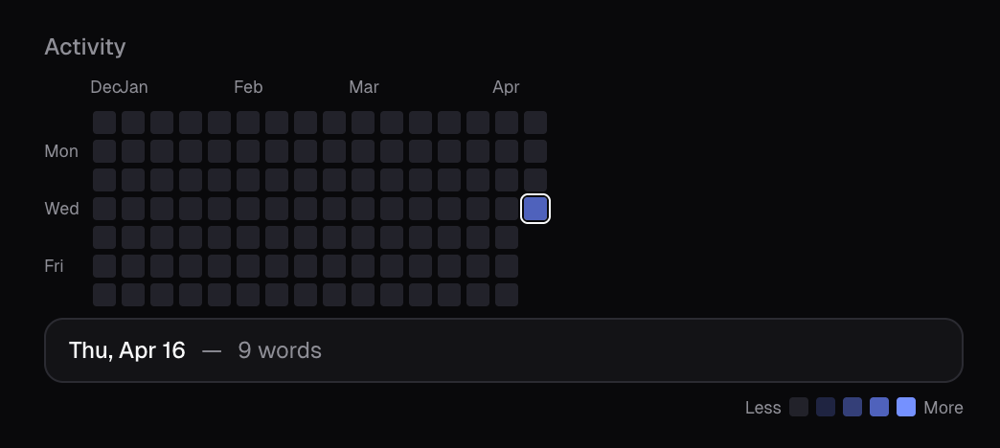
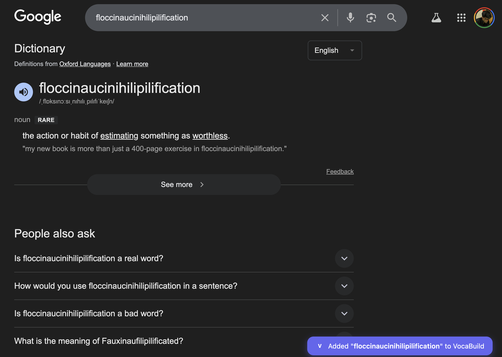

# VocaBuild

A mobile-first vocabulary builder that helps you learn new words and actually remember them. Search any word, get the full breakdown, and quiz yourself later.

**[Live App](https://vocabuild.vercel.app)**



## How it works

**Search a word** and get a Google-style definition card — meaning, pronunciation (with audio), usage examples, synonyms, and antonyms. Every word you look up is saved automatically to your personal word bank.

**Review with quizzes** — four quiz modes (Meanings, Synonyms, Antonyms, Mixed) test your knowledge with multiple-choice questions. A spaced repetition system prioritizes words you struggle with, and curated vocabulary words are mixed in to introduce you to new ones.

## Features

### Word Lookup
- Autocomplete search powered by Datamuse
- Definitions, pronunciation (audio + phonetic), examples, synonyms, antonyms
- Falls back to browser text-to-speech when audio isn't available
- Tap any synonym or antonym to instantly look up that word



### Word Bank
- Every searched word is saved automatically
- Sort by recent, alphabetical, or needs review
- Tap any word to expand the full definition card
- Accuracy indicators show which words you've mastered



### Quiz & Review
- Four modes: Meanings, Synonyms, Antonyms, Mixed
- After answering, the full word card is shown so you learn as you go
- New vocabulary words from a curated list are mixed into quizzes
- Spaced repetition prioritizes weak and stale words
- Review Mistakes lets you retry only the ones you got wrong




### Activity Tracking
- GitHub-style contribution chart on the Review tab
- Tracks words added and quiz answers per day
- Tap any square to see the date and activity breakdown




### Chrome Extension
- Automatically captures words from Google's dictionary card
- Shows a toast confirming the word was added
- Syncs to VocaBuild instantly if the app is open, otherwise queues for next visit
- Skips words already in your bank



### Cross-Device Sync
- **GitHub Gist sync** — words sync across phone and laptop via a private gist. Just add a GitHub token with `gist` scope in Settings and hit Sync
- **Export/Import** — download your word bank as JSON, import on another device. Works offline

### iOS Shortcut
- Highlight any word on your iPhone, tap Share, tap "Add to VocaBuild"
- The app opens, looks up the word, and saves it automatically
- Works from any app — Safari, Kindle, Notes, anywhere

### AI Insights (Optional)
- Add a Gemini API key in Settings to unlock:
  - Memory tips (mnemonics to remember words)
  - AI-generated example sentences
  - Word connections linking new words to ones you've already searched
- All AI features are optional — the app works fully without them

### Dark Mode
- Light, dark, and system theme options in Settings

<add screenshot here>

## Setup

```bash
pnpm install
pnpm dev
```

### Chrome Extension

1. Go to `chrome://extensions`
2. Enable Developer Mode
3. Click "Load unpacked" and select the `chrome-extension/` folder

### iOS Shortcut

1. Open Shortcuts app
2. Create a new shortcut: **Receive Text from Share Sheet** -> **URL** (`https://vocabuild.vercel.app/?add=Shortcut Input`) -> **Open URLs**
3. Name it "Add to VocaBuild" and enable "Show in Share Sheet"

## Tech Stack

React + TypeScript, Tailwind CSS + shadcn/ui, Dexie.js (IndexedDB), Vite, vite-plugin-pwa. APIs: Free Dictionary API, Datamuse, Gemini (optional). Hosted on Vercel.
